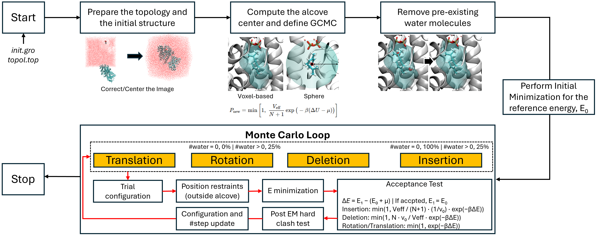
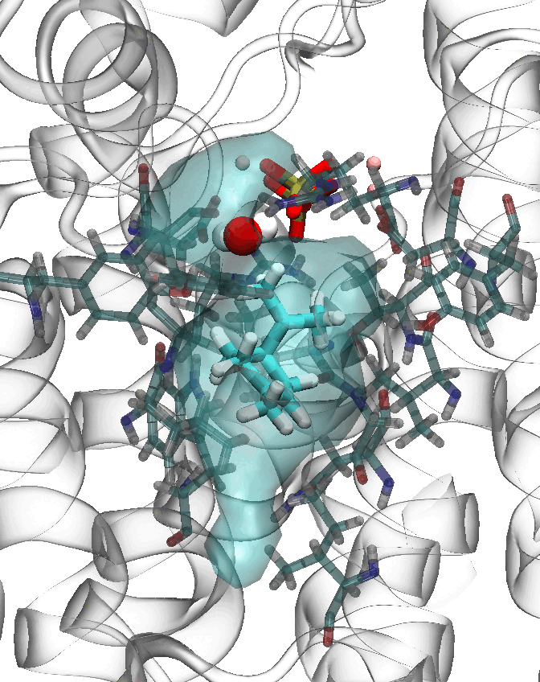
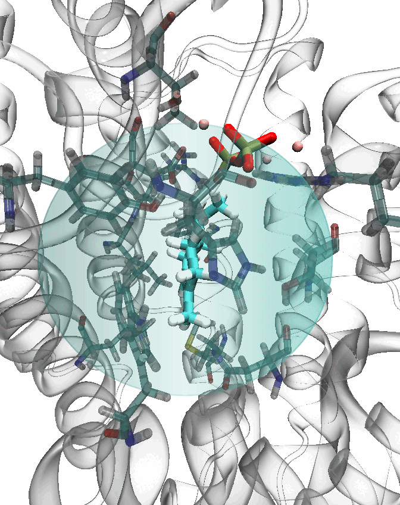

# PocketMC Tutorial

This tutorial is written around the bundled example created by:

```bash
python gcmc.py init-example -o ./quickrun
```

That example is a substrate-bound protein-pocket case configured to sample water insertion and deletion around the pocket.

> [!WARNING]
> PocketMC minimizes each proposed structure before applying its acceptance test. The resulting
> sequence is best used as a search over relaxed structures and pocket occupancies. Interpret state
> frequencies and thermodynamic quantities only after validating the complete protocol for the
> chosen molecular model and scientific question.

## 0. PocketMC Workflow Diagram



The diagram above is the short version. In practice, PocketMC follows this order:

1. Copy the input structure, topology, force-field assets, and MDP files into each run directory.
2. Center the initial structure and run a quality check on that centering step.
3. Define the pocket sampling region using either a sphere around a reference residue or a prebuilt voxel cavity mask.
4. Remove pre-existing cavity waters and obtain a reference energy $E_0$ by minimization.
5. Enter the Monte Carlo loop with insertion, deletion, rotation, and translation proposals.
6. After each proposal, run EM relaxation, reject obviously bad geometries, and then apply the acceptance test.
7. Stop when the run reaches `max_trials`, hits `target_nmol`, or encounters too many consecutive insertion-point failures.

## 1. Before You Start

Start with a fresh checkout unless you already have one:

```bash
git clone https://github.com/pnnl/PocketMC.git
cd PocketMC
```

The directory containing `pyproject.toml` and `gcmc.py` is the repository root.
Choose one isolated Python setup below.

### 1.1 Conda Setup

```bash
conda create -n pocketmc python=3.12 pip -y
conda activate pocketmc
python -m pip install --upgrade pip setuptools wheel
python -m pip install -e .
```

### 1.2 Standard `venv` Setup

Linux/macOS:

```bash
python3 -m venv .venv
source .venv/bin/activate
python -m pip install --upgrade pip setuptools wheel
python -m pip install -e .
```

Windows PowerShell:

```powershell
py -3.12 -m venv .venv
.\.venv\Scripts\Activate.ps1
python -m pip install --upgrade pip setuptools wheel
python -m pip install -e .
```

PocketMC requires Python 3.11 or newer. The install command above supplies the
Python dependencies but not GROMACS. Load or activate a GROMACS installation in
the same shell and verify either `gmx --version` or `gmx_mpi --version`. On an HPC
system, use the module names provided by that site.

Verify the PocketMC commands before continuing:

```bash
gcmc-port --help
pocketmc-analyses --help
python gcmc.py --help
```

Use [README.md](README.md) for the non-editable pip option, network-restricted
installation, GROMACS setup details, and troubleshooting.

All commands below are shown from the repository root.

Reading convention used in this tutorial:

- `What you do`: choices or commands the user is expected to provide
- `What PocketMC does`: internal workflow steps performed automatically after you run a command

## 2. Build The Tutorial Baseline Case

Create the bundled example case:

```bash
python gcmc.py init-example -o ./quickrun
```

Run it with:

```bash
python gcmc.py run -c ./quickrun/config.example.toml
```

The example config lives beside the case data, so its paths are intentionally simple:

```toml
[paths]
project_root = "."
work_root = "."
```

For this tutorial, treat `./quickrun` as the reference case directory.
That gives you a concrete place to inspect:

- `config.example.toml`
- `topol.top`
- `init.gro`
- per-replica run directories such as `00`, `01`, `02`, `03`, `04`
- output files such as `workflow.log`, `mc.log`, `trajectory.gro`, and `cavity_trajectory.gro` when mask mode is used

## 3. Workflow Stage 1: Prepare And Center The Initial Structure

This stage mixes one user responsibility with several automatic preprocessing steps, so it helps to separate them explicitly.

What you do:

- provide a valid `topol.top`
- provide a valid `init.gro`
- choose the config file that points to those inputs

What PocketMC does:

- copy the required inputs into each run directory
- perform early structure preparation before the MC loop begins

Core inputs for any case:

- `topol.top`: the system topology
- `init.gro`: the starting structure
- `chk.mdp`: reference-energy minimization settings
- `steep.mdp`: initial cleanup minimization settings
- `em.mdp`: per-trial relaxation settings

Internal initialization steps:

1. Copy inputs into the run directory.
2. Merge water bookkeeping in the topology.
3. Run `editconf`, `make_ndx`, and `grompp` to prepare the first centered structure.
4. Run a centering workflow based on `trjconv`.
5. Check centering quality by measuring what fraction of protein atoms lies too close to the box boundary.

Why this matters to you:

- cavity definition depends on a stable reference geometry
- poor centering can break cavity detection or make later acceptance behavior look inconsistent

Important implementation detail:

- PocketMC first tries a cluster/mol centering path.
- If that looks poor, it falls back to a nojump/center path.
- If the best result is still too poor, the run stops before entering MC.

## 4. Workflow Stage 2: Define The Pocket Sampling Region

PocketMC supports two region definitions:

- `sphere`: a legacy anchor-centered spherical region
- `mask`: a voxel cavity mask built from the structure

### 4.1 Visual Comparison

| Cavity mask mode (left) | Sphere mode (right) |
| --- | --- |
|  |  |

### 4.2 Sphere Mode

Sphere mode defines the proposal region from a reference point computed from one residue or one residue plus selected atom names.

What you do:

- choose `mode = "sphere"`
- specify the anchor residue and, if needed, the atom names used to define the local center
- choose a reasonable `rmax`

What PocketMC does:

- compute the reference center from the configured residue information
- sample insertion positions inside the sphere during the MC loop
- build a restraint shell around that local region

Main inputs:

- `[anchor].anchor`, `resid`, `resname`: identify the reference residue
- `[anchor].center_atoms`: atom names used to define the local center in atom-based mode
- `[simulation].rmax`: insertion sphere radius in nm
- `[simulation].rfree`: restraint-shell multiplier around that region

Use sphere mode when:

- you already know the active site center
- a simple local spherical envelope is enough
- you want the lightest setup without precomputing a cavity mask

### 4.3 Mask Mode

Mask mode defines the sampling region as a set of voxel points. This is more geometric and usually better when the pocket is irregular, elongated, or strongly shaped by the protein surface.

What you do:

- choose `mode = "mask"`
- provide `mask_file` and usually `mask_meta`
- generate those files either with `python gcmc.py build-cavity ...` or through the interactive wizard workflow
- decide whether the cavity should be built in a preprocessing step or generated through the interactive workflow

What PocketMC does:

- load the voxel mask and recover `dx`, `Veff`, and the reference point
- align that mask to the centered structure
- use the aligned mask for occupancy checks and insertion proposals

> [!IMPORTANT]
> If you generate the cavity with `python gcmc.py build-cavity ...`, always visualize the resulting `*_points.pdb` file with a molecular viewer such as VMD and confirm that the voxel cavity actually covers the intended pocket.
> Do not assume the cavity is correct just because `build-cavity` completed successfully.
> This visual check is especially important before running mask-mode production jobs.

Main inputs:

- `[cavity].mask_file`: the voxel membership file
- `[cavity].mask_meta`: metadata with `dx`, `Veff`, and the reference point
- `[cavity].membership_padding`: tolerance for deciding whether a water oxygen is inside the mask
- `[cavity].initial_delete_padding`: extra one-time cleanup padding during startup only
- `[cavity].restraint_radius`: radius of the restraint shell around the cavity reference point
- `[simulation].mask_dx`: proposal jitter in mask mode; `0` means use the mask voxel spacing

Use mask mode when:

- the pocket is visibly non-spherical
- you want occupancy to mean "waters inside this actual cavity" rather than "waters inside a sphere"
- you want to separate cavity discovery from MC sampling

### 4.4 Why The Two Modes Behave Differently

Sphere mode samples trial insertion positions by drawing random points inside a radius $r_{\max}$ around the reference center.

Mask mode samples trial insertion positions from the discrete cavity voxels and optionally jitters each proposal within the local voxel neighborhood.

That changes two important quantities:

1. The effective volume $V_{\mathrm{eff}}$.
2. The meaning of occupancy `nins` during the acceptance test.

In sphere mode, $V_{\mathrm{eff}}$ comes from the sphere radius:

$$
V_{\mathrm{eff}} = \frac{4}{3}\pi r_{\max}^3
$$

In mask mode, $V_{\mathrm{eff}}$ comes from the mask metadata and voxel count.

## 5. Workflow Stage 3: Remove Initial Waters And Obtain The Reference State

Before the MC loop begins, PocketMC creates a reference state with energy $E_0$.

What you do:

- choose the cavity definition correctly
- provide minimization input files that are compatible with your system
- optionally tune `max_e0_tries` or mask cleanup parameters if startup is unstable

What PocketMC does:

- remove pre-existing waters from the active region
- run startup minimization
- obtain the reference energy $E_0$

For both modes, PocketMC first removes pre-existing waters from the active region:

- sphere mode: waters are removed based on distance from the reference center
- mask mode: waters are removed if their oxygen lies inside the voxel cavity

After that, PocketMC runs steepest-descent minimization and then a reference minimization based on `chk.mdp`.

Important details:

1. The reference energy step can retry up to `max_e0_tries` times.
2. In mask mode, PocketMC checks whether waters re-entered the cavity after EM.
3. If that happens, PocketMC deletes those waters and retries the reference step, for up to five cleanup cycles.

This reference state provides the baseline energy used in all later acceptance decisions.

## 6. Workflow Stage 4: Monte Carlo Loop

This is the core of PocketMC.

What you do:

- choose the simulation parameters that define the MC ensemble and geometric constraints
- decide whether occupancy should be controlled by a sphere or a voxel mask
- inspect outputs such as `workflow.log`, `mc.log`, and trajectories after the run

What PocketMC does:

- choose moves, build trial configurations, minimize them, reject bad proposals, and apply the acceptance test automatically

### 6.1 Move Selection

At each trial, PocketMC chooses one MC move:

- insertion
- deletion
- rotation
- translation

Move probabilities:

1. If the current cavity occupancy is zero, insertion is forced.
2. Otherwise, insertion, deletion, rotation, and translation are each chosen with probability 25%.

### 6.2 Trial Proposal

For each move type, PocketMC builds a trial configuration.

What you choose indirectly through the config:

- the proposal geometry via `rmax`, `mask_dx`, and the cavity definition
- how strict clash filtering is via `rvdw`

What PocketMC does internally:

- generate candidate positions and orientations
- retry failed insertion-point searches up to 2000 times
- reject impossible trial geometries before EM

Insertion:

1. Generate a candidate position inside the sphere or from the voxel mask.
2. Randomly orient the inserted molecule.
3. Reject candidate positions that create an immediate heavy-atom clash.
4. Retry up to 2000 candidate positions.
5. If all 2000 fail, the insertion proposal fails with `Could not find valid insertion point`.

Deletion:

1. Select one currently inserted molecule.
2. Remove it from the structure.
3. Update the molecule count in the topology.

Rotation and translation:

1. Select one currently inserted molecule.
2. Rotate or translate it.
3. Reject the trial immediately if it creates a heavy-atom clash before EM.

### 6.3 Relaxation And Structural Checks

Every accepted proposal candidate then goes through structural refinement:

What you do:

- choose the minimization settings in `em.mdp`
- choose the restraint strength through `kres`

What PocketMC does:

- write the restraint file
- run EM
- re-center the structure
- apply post-EM geometry and occupancy checks

1. Write position restraints for atoms outside the local movable region.
2. Run `grompp` with `em.mdp`.
3. Run `mdrun` minimization.
4. Re-center the minimized structure.

After EM, PocketMC applies additional checks:

- if EM fails, reject the proposal
- if insertion, rotation, or translation leaves a post-EM hard clash, reject the proposal
- in mask mode, if the final cavity occupancy does not match the expected occupancy change, reject the proposal

The mask-mode occupancy check is important because it ensures that "accepted cavity waters" really remain inside the intended voxel cavity after minimization.

### 6.4 Chemical Potential And Energy Difference

The estimate of the chemical potential of small molecules in supramolecular
pockets is the most important scientific input to this workflow. It directly
changes the acceptance weighting and should be calibrated for the same molecular
model, force field, nonbonded settings, temperature, and reference state used in
the run. It is model-dependent rather than a universal constant; sensitivity
tests over a justified range are recommended when its uncertainty matters.

PocketMC computes the working excess chemical potential as:

What you do:

- set `mu0`, `temperature`, `pressure`, and `v0` consistently with the system you want to model

What PocketMC does:

- convert those inputs into the working chemical potential and the trial energy difference used in the acceptance test

$$
\mu_{T,p} = \mu_{\mathrm{ex},0} + RT\ln (f/f_0)
$$

where:

- $\mu_{\mathrm{ex},0}$ is `[simulation].mu0`, calibrated for the same molecular model and nonbonded settings
- $R$ is `[simulation].gas_constant`
- $T$ is `[simulation].temperature`
- $f/f_0$ is the positive, dimensionless activity/fugacity ratio stored in `[simulation].pressure`

The trial energy difference is:

$$
\Delta E = E_1 - (E_0 + \mu)
$$

with:

- insertion: $\mu = +\mu_{T,p}$
- deletion: $\mu = -\mu_{T,p}$
- rotation or translation: $\mu = 0$

### 6.5 Acceptance Test

PocketMC evaluates the move with:

What you do:

- control acceptance behavior indirectly through geometry, force-field choice, minimization behavior, and thermodynamic parameters

What PocketMC does:

- evaluate the move-specific prefactor and accept or reject the proposal stochastically

$$
P_{\mathrm{acc}} = \min\left(1, \; \mathrm{pref} \; e^{-\beta \Delta E}\right)
$$

where:

$$
\beta = \frac{1}{RT}
$$

and the move-dependent prefactor is:

Insertion:

$$
\mathrm{pref}_{\mathrm{ins}} = \frac{V_{\mathrm{eff}}/v_0}{n_{\mathrm{ins}}+1} \times q_{\mathrm{ratio}}
$$

Deletion:

$$
\mathrm{pref}_{\mathrm{del}} = n_{\mathrm{ins}}\frac{v_0}{V_{\mathrm{eff}}} \times q_{\mathrm{ratio}}
$$

Rotation or translation:

$$
\mathrm{pref}_{\mathrm{rot/trans}} = 1
$$

Here:

- $V_{\mathrm{eff}}$ is the effective cavity volume
- $v_0$ is `[simulation].v0`
- $n_{\mathrm{ins}}$ is the current occupancy used by the acceptance test
- $q_{\mathrm{ratio}}$ is a proposal-symmetry correction used by the implementation at the occupancy boundary

The boundary correction is:

- insertion with `nins = 0`: $q_{\mathrm{ratio}} = 0.25$
- deletion with `nins = 1`: $q_{\mathrm{ratio}} = 4.0$
- otherwise: $q_{\mathrm{ratio}} = 1.0$

### 6.6 Stop Conditions

The loop stops when any of these conditions is met:

What you do:

- decide whether `target_nmol` should be active
- decide how aggressive the early-stop rule for failed insertions should be

What PocketMC does:

- terminate the run automatically when one of the configured stop conditions is reached

1. `max_trials` is reached
2. `target_nmol` is reached
3. insertion proposals fail too many times in a row with `Could not find valid insertion point`

That third condition is controlled by `[simulation].max_consecutive_insertion_failures`.
It is useful because repeated insertion-point failure usually means the cavity is effectively saturated under the current geometry and clash settings.

## 7. Inputs That Matter Most During The Workflow

This section is intentionally selective. It focuses on the parameters you are most likely to tune while following the bundled example.

### 7.1 Paths And Runtime Inputs

| Key | Meaning in practice |
| --- | --- |
| `[paths].project_root` | Base directory for relative inputs |
| `[paths].work_root` | Where PocketMC creates run directories |
| `[paths].topology` | Main topology file, usually `topol.top` |
| `[paths].init_gro` | Starting structure |
| `[paths].gas_gro` | Template molecule inserted by MC |
| `[paths].water_itp` | Topology include for the inserted molecule |

### 7.2 Execution Settings

| Key | Meaning in practice |
| --- | --- |
| `[execution].gmx_cmd` | `gmx` or `gmx_mpi` |
| `[execution].launcher_single` | Launcher for `grompp`, `trjconv`, and similar commands |
| `[execution].launcher_multi` | Launcher for `mdrun` |
| `[execution].module_setup` | Restricted `module purge/load/unload/swap` operations written into generated launchers |
| `[execution].env` | Environment variables passed directly to GROMACS without shell evaluation |

PocketMC invokes GROMACS with an argument list and `shell=False`. Arbitrary shell
commands in TOML are rejected. When running `python gcmc.py run` directly, load
the required cluster modules in your current shell first; generated `.sh` and
`.sbatch` launchers perform the validated `module_setup` operations for you.

### 7.3 Sphere-Mode Geometry Controls

| Key | Meaning in practice |
| --- | --- |
| `[anchor].anchor` | Residue token used to define the sphere center |
| `[anchor].center_atoms` | Which atoms define the local reference center |
| `[simulation].rmax` | Sphere radius for insertion proposals |
| `[simulation].rfree` | Multiplier for defining the restraint shell |

### 7.4 Shared MC Controls

| Key | Meaning in practice |
| --- | --- |
| `[simulation].temperature` | Temperature used in the acceptance test |
| `[simulation].pressure` | Dimensionless activity/fugacity ratio $f/f_0$ in $\mu_{T,p}$ |
| `[simulation].mu0` | Model-calibrated excess chemical potential |
| `[simulation].gas_constant` | Gas constant used in the equations |
| `[simulation].v0` | Standard-state molecular volume |
| `[simulation].rvdw` | Heavy-atom clash cutoff used during proposal generation and post-EM screening |
| `[simulation].max_trials` | Maximum MC trials |
| `[simulation].target_nmol` | Occupancy stop condition |
| `[simulation].max_consecutive_insertion_failures` | Early-stop threshold for insertion-point failures |
| `[simulation].kres` | Position-restraint force constant |
| `[simulation].max_e0_tries` | Retry count for obtaining the reference energy |

### 7.5 Mask-Mode Geometry Controls

| Key | Meaning in practice |
| --- | --- |
| `[cavity].mask_file` | Voxel membership file used during MC |
| `[cavity].mask_meta` | Metadata with `dx`, `Veff`, and reference point |
| `[cavity].membership_padding` | Tolerance for mask membership decisions |
| `[cavity].initial_delete_padding` | Extra startup-only cleanup padding |
| `[cavity].restraint_radius` | Radius of the restraint shell in mask mode |
| `[simulation].mask_dx` | Proposal jitter inside the mask |

## 8. Building And Using A Cavity Mask

If you want to convert the bundled example or your own case from sphere mode to mask mode, the workflow is:

What you do:

- run `build-cavity`
- inspect the output files
- choose the final cavity candidate
- update the `[cavity]` section of the config

What PocketMC does:

- construct voxelized cavity outputs from the structure
- write the geometry, metadata, and nearby-residue reports needed for later MC runs

1. Build the cavity.
2. Inspect the generated outputs.
3. Choose the final cavity.
4. Point `[cavity]` at that mask.
5. Run PocketMC again.

Typical seeded example:

```bash
python gcmc.py build-cavity -f ./quickrun/init.gro -o ./quickrun/apo --mode seeded --seed-residue 123LIG --exclude-residue 123LIG
```

Replace `123LIG` with the residue token that marks the pocket in your structure.

Typical auto-search example:

```bash
python gcmc.py build-cavity -f ./quickrun/init.gro -o ./quickrun/apo --mode auto --exclude-residue 123LIG --candidate-limit 3
```

Important `build-cavity` flags:

| Flag | Meaning | When to tune it |
| --- | --- | --- |
| `-f`, `--gro` | Input GRO structure | Always required |
| `-o`, `--output-prefix` | Prefix for all cavity output files | Use different prefixes to compare candidates |
| `-m`, `--mode` | `seeded` or `auto` | `seeded` for a known site; `auto` to search |
| `-S`, `--seed-residue` | Residue token that defines the seed point | Best when a ligand or cofactor marks the pocket |
| `-p`, `--seed-point` | Manual seed point in nm | Use when you already know the center |
| `-a`, `--seed-atoms` | Atom names used to compute the seed-residue center | Use when default atoms bias the site poorly |
| `-E`, `--exclude-residue` | Residue removed from cavity discovery and final envelope | Useful for bound ligands or blockers |
| `-x`, `--dx` | Voxel spacing in nm | Lower is finer and more expensive |
| `-r`, `--probe-radius` | Minimum local clearance in nm | Increase to make the cavity more conservative |
| `-R`, `--search-radius` | Local search radius in nm | Increase to recover larger connected pockets |
| `-n`, `--nearby-cutoff` | Cutoff for nearby-residue reporting | Tune for broader or tighter reports |
| `-k`, `--min-peak-clearance` | Auto-mode minimum clearance for seed candidates | Increase to suppress shallow pockets |
| `-C`, `--candidate-limit` | Maximum number of auto candidates written | Increase to keep more backup options |
| `-N`, `--min-points` | Minimum voxel count for a cavity | Increase to remove tiny fragments |

Expected outputs include:

- `*_mask.dat`
- `*.meta.json`
- `*_points.pdb`
- `*_nearby_residues.tsv`
- in auto mode, `*_candidates.tsv`

Example mask-mode config snippet:

```toml
[cavity]
mode = "mask"
mask_file = "apo_mask.dat"
mask_meta = "apo.meta.json"
restraint_radius = 1.2
membership_padding = 0.02
initial_delete_padding = 0.02
```

## 9. Commands You Will Actually Use Most Often

| Command | What it does |
| --- | --- |
| `python gcmc.py init-example -o ./quickrun` | Create the bundled example case used in this tutorial |
| `python gcmc.py run -c ./quickrun/config.example.toml` | Run the bundled example |
| `python gcmc.py --interactive` | Launch the interactive wizard |
| `python gcmc.py init-defaults -o ./my-case` | Copy the baseline bundled assets into a new case directory |
| `python gcmc.py build-cavity ...` | Build a voxel cavity mask |
| `python gcmc.py emit-sbatch -c ./my-case/config.toml -o ./my-case/jobs/run_gcmc.sbatch` | Generate an sbatch script |
| `python gcmc.py submit -c ./my-case/config.toml -o ./my-case/jobs/run_gcmc.sbatch` | Generate and submit an sbatch script |

## 10. Slurm Notes

`python gcmc.py --interactive` writes three launchers beside the generated TOML:

| File | Intended environment | Required review |
| --- | --- | --- |
| `run_gcmc.sh` | Direct shell execution | Ensure Python and GROMACS are active, then run `./run_gcmc.sh` |
| `run_gcmc.sbatch` | Any Slurm cluster | Replace `YOUR_ACCOUNT`; review partition, time, nodes, and tasks |
| `run_gcmc_tahoma_only.sbatch` | Tahoma | Replace `YOUR_ACCOUNT`; confirm the hard-coded module setup is still appropriate |

The direct launcher has no `#SBATCH` lines and needs no allocation/account value.
If necessary, make it executable first:

```bash
chmod +x run_gcmc.sh
./run_gcmc.sh
```

The generic and Tahoma-only files deliberately retain `YOUR_ACCOUNT`, causing a
submission to fail until the user replaces it. Both use paths relative to the
launcher location, so moving or sharing a complete case does not record the
original user's absolute checkout path.

To regenerate only the generic Slurm script from an existing TOML:

```bash
python gcmc.py emit-sbatch -c ./my-case/config.toml -o ./my-case/jobs/run_gcmc.sbatch
```

To generate and explicitly submit that generic script:

```bash
python gcmc.py submit -c ./my-case/config.toml -o ./my-case/jobs/run_gcmc.sbatch
```

Before using `submit`, set `[slurm].account`, time, partition, and the execution
node/core values in the TOML. The generic renderer carries over:

- module setup commands
- environment variables under `[execution].env`
- Slurm settings from `[slurm]`
- node/task values from `[execution]`
- the config path relative to the generated script; execution uses the installed `gcmc-port` command

## 11. Moving From The Bundled Example To Your Own Case

Once the bundled example makes sense, the simplest migration path is:

1. Make a new case directory.
2. Copy in your own `topol.top` and `init.gro`.
3. Copy the bundled defaults if you need the baseline FF14SB and TIP3P assets.
4. Start from the bundled example config and edit only the minimum fields first.
5. Decide early whether your site should stay in sphere mode or move to mask mode.

That keeps the first custom run close to a known-working reference instead of changing every setting at once.

## 12. Analysis Wizard and Reproducible Runs

Install the project in a Python 3.11+ environment (Python 3.14 is supported),
then open the analysis wizard:

```bash
python -m pip install -e .
python analyses.py
```

The wizard asks for MD versus PocketMC accepted states, single-case versus
workflow-config batch input, molecule definition, sphere versus mask cavity,
and a comma-separated set of tasks. It writes `analyses.toml`,
shows the expanded prerequisites and output directory, validates the inputs,
and runs immediately. The same saved selection can then be checked or rerun:

```bash
python analyses.py validate -c analyses.toml
python analyses.py run -c analyses.toml --jobs 4
python analyses.py run -c analyses.toml --tasks density,plots,vmd --force
```

For a custom molecule, choose `atom`, `cog`, or `com` as its representative
point. `com` requires usable masses in the MD topology and fails explicitly
when they are absent. GRO-only PocketMC states do not carry mass metadata, so
use `atom` or `cog` for them. The water preset recognizes `SOL/WAT/HOH` and
`OW/O/OH2`; the CO preset tracks the physical CO center rather than its dummy
site.

For cross-system residue reporting, optional `analysis.canonical_source` and
`analysis.homolog_source` PDB/GRO files (plus their chain fields) align the
protein sequences. Sample/path tables retain the displayed canonical label,
original simulation label, and homolog label instead of discarding any of the
numbering systems.

The main task dependencies are:

```text
MD:       occupancy/lifetime -> path/trace -> density -> plot/VMD
PocketMC: mc.log + accepted states -> state statistics/density -> plot/VMD
```

Shared prerequisites are calculated once when several tasks are selected.
`all` generates data, PNGs, density viewer inputs, and VMD Tcl files, but never
launches a GUI. VMD is checked only by `launch-vmd`; ordinary result generation
works without a VMD executable.

### MD interpretation

MD membership is evaluated in the aligned cavity frame with periodic-boundary
handling. A short outside interval can be healed using `analysis.gap_ps` (the
default is 1000 ps). Visits already present at the first analyzed frame are
left-censored. Visits still present at the final frame are right-censored;
Kaplan-Meier curves exclude left-censored visits and treat the latter as
right-censored observations.

### PocketMC interpretation

New runs retain the existing fixed-atom-count `trajectory.gro` and append a
`trajectory.meta.jsonl` sidecar. Each JSON record stores accepted-state number,
trial, move, energy, active molecule count, dummy range, and stable molecule
UID/residue/provenance. Padding uses the selected gas template atom count, not
a hard-coded three-site water. Legacy trajectories remain readable; inferred
identities are reported as `legacy_identity_inferred` in summaries and
manifests.

Accepted states support move-acceptance, occupancy, energy, and spatial-occurrence
diagnostics. Their order records search progression rather than physical
dynamics. Use physical MD trajectories when the scientific question concerns
transport or lifetime, and validate the protocol separately before quantitative
thermodynamic interpretation.

### Plot regeneration and visualization

Normal analysis renders through trusted installed PocketMC functions; it does
not import or execute `plot_results.py` from a result directory. That generated
file is retained only as an explicit, user-invoked editing aid. Edit its
top-level `STYLE` values and run it when desired:

```bash
python analysis-results/plot_results.py
python analyses.py view-density analysis-results/my-run/density/density_maps.npz
python analyses.py launch-vmd analysis-results/my-run/vmd/session.vmd.tcl
```

The VMD session can display protein, sphere/mask, MD entry (red), exit (blue),
resident (gray) traces, density CUBE, and nested 90/70/50/30% HPD layers. MC
states are shown without state-to-state connecting lines.

Trajectory reuse uses `.analysis_cache/metadata.json` plus an uncompressed
`.analysis_cache/records.npz` opened with `allow_pickle=False`. PocketMC never
loads legacy `.analysis_cache.pkl` files; the first run over an old result
rebuilds the safe cache, while later runs retain normal cache performance.
Generated TOML, manifests, launchers, and VMD sessions prefer paths relative to
the file containing them so result trees can be moved without exposing the
original checkout path.

### Discovering mixed MD and PocketMC cases

Running `python analyses.py` now asks for a scan root and recursively examines
up to four subdirectory levels. The table reports physical-MD capability,
PocketMC accepted-state capability, whether a production MD appears to descend
from a PocketMC case, and the files supporting each classification. Use the
non-interactive form to inspect the same information without writing anything:

```bash
python analyses.py discover /path/to/cases --max-depth 4
python analyses.py discover /path/to/cases --max-depth 4 --deep --json
```

`--deep` opens recommended trajectory pairs to report frame/time metadata.
PocketMC minimization TRR files are not treated as physical MD. If an MD pair is
present, the wizard chooses it without a capability question; only MC-only cases
require confirmation because accepted MC states are not a physical timeline.
The wizard materializes the selected input as a `[[case]]` table, so a saved
configuration does not depend on a later directory rescan.

For mask-mode cases, one review table shows the case directory and the cavity
artifacts: `*_mask.dat`, `*.meta.json`, `*_points.pdb`, and
`*_nearby_residues.tsv`. Enter a case number to supply a different directory or
mask path. If there was no MC run from which to recover a mask, selecting mask
mode records a deferred seeded voxel build and asks for its source GRO. Nothing
is built during the wizard; it is built by the saved launchers.

The wizard writes `run_analyses.sh`, `run_analyses.sbatch`, and
`run_analyses_tahoma_only.sbatch` beside `analyses.toml`. The first is a direct
shell launcher, the second is a generic Slurm template, and the third contains
the Tahoma environment preset. Each launcher reports cavity preparation,
validation, current case/tasks, and final aggregation. The direct shell launcher
also writes `analysis-run.log`; Slurm uses the configured `.out`/`.err` files.
Replace `YOUR_ACCOUNT` and review the requested resources before submission.
The analysis uses one Python process and can use `--jobs` to parallelize
independent cases without launching MPI ranks.

If a previous root manifest is partial, the next interactive start offers four
numbered actions: repair/resume (default), use `analysis-results_1`/`_2`, force
an overwrite run, or start a completely new discovery setup. Resume launchers
retain the old output root and use cache fingerprints to skip successful pose
features and pooled clustering while retrying failed hydration or per-case
analysis.

If the root manifest is complete, the next interactive start instead offers
`Modify result plots`. Select one or more plot groups (use `A` or `0` for all),
inspect the current axis/grid/font/color/isosurface/substrate settings, and
redraw only those plots immediately. This operation uses saved tables and NPZ
grids and does not reread the MD trajectories. The choices are stored in
`analysis-results/plot_style.json`.

The non-interactive equivalent is:

```bash
python analyses.py replot analysis-results --list
python analyses.py replot analysis-results --targets 100-C01:pose-density-2d \
  --set density_display_grid_A=0.5 --set grid_spacing_A=2.0
```

`density_display_grid_A` is a display-only interpolation setting. Changing the
scientific density bin would require a density recomputation; the plot editor
intentionally leaves `density_maps.npz` unchanged.

Residue numbers may differ between homologs or prepared systems. The wizard
therefore resolves an anchor by exact token first and then by a unique matching
residue name per case. If a topology contains multiple matching residues, it
shows a numbered list and requires a case-specific choice. This anchor preflight
is part of validation and happens before pose feature/hydration work starts.

### Common substrate pose clusters

For physical MD, select one or more non-protein residues as one substrate. The
wizard supports substrates composed of multiple residue components. Choose a
canonical reference and conserved local-pocket backbone selection; every sampled
and assigned frame is transformed into that same coordinate frame before pose comparison.
Homologs and replicas sharing `comparison_group` fit one pooled model with equal
system and replica weights.

The default model uses three clusters. Before fitting it, the wizard reports
the trajectory frame counts and asks:

```text
Maximum clustering-training frames per trajectory [5000]
```

The selected training indices are exact, uniformly spaced, and include both
endpoints. `0` in TOML or `all` in the wizard uses every eligible frame. The
canonical-aligned sample is always written to `cluster_training.xtc`, with the
source frame/time mapping in `cluster_training_frames.tsv`. Only model fitting
and PCA fitting use this reduced set. All eligible frames are subsequently
assigned to the common clusters, so water maps, pose populations and temporal
profiles keep the full MD sampling.

For each common cluster, PocketMC Analyses writes the real closest MD frame,
its actual cavity waters, conditional density, discrete hydration sites and
two coordinate-frame maps:

- `pocket-frame` keeps the substrate pose relative to the conserved pocket.
- `substrate-frame` aligns the substrate core to the common representative.

Each frame directory also contains `substrate_overlay.npz`. The 2D maps project
the selected substrate as an element-colored ball-and-stick structure with
residue labels. The 3D maps draw nested connected isosurfaces with
an actual-density colorbar and level legend, plus the same substrate. All
substrate-frame plots for one pooled cluster therefore show the substrate at the
same position and angle; local pocket-frame structure is still allowed to vary.

Different cavity masks can legitimately produce different case grid shapes.
Before aggregate means or differences are calculated, aligned case densities
are interpolated onto a common union grid and their integrals are preserved.
This prevents `ValueError: all input arrays must have the same shape` during the
finalize stage while retaining each case's full spatial extent.

Reserve physical hydration interpretation for MD trajectories. Mixed configs
keep accepted-state search diagnostics separate.

### Slurm pose pipeline

Large homolog/replica sets can use the generated dependency chain:

```bash
python analyses.py emit-sbatch -c analyses.toml -o analysis-jobs
python analyses.py submit-sbatch -c analyses.toml -o analysis-jobs
```

The stages are feature-extraction array, pooled clustering, full-frame hydration
array, and comparison finalize. Submission is never automatic during a normal
analysis run. Failed array elements are recorded and `afterany` allows the
finalizers to report partial results.

## 13. License and Disclaimer

Copyright Battelle Memorial Institute 2026. See [LICENSE](LICENSE) for the
redistribution terms and the applicable U.S. Government, U.S. Department of
Energy, Battelle, and PNNL disclaimer.
